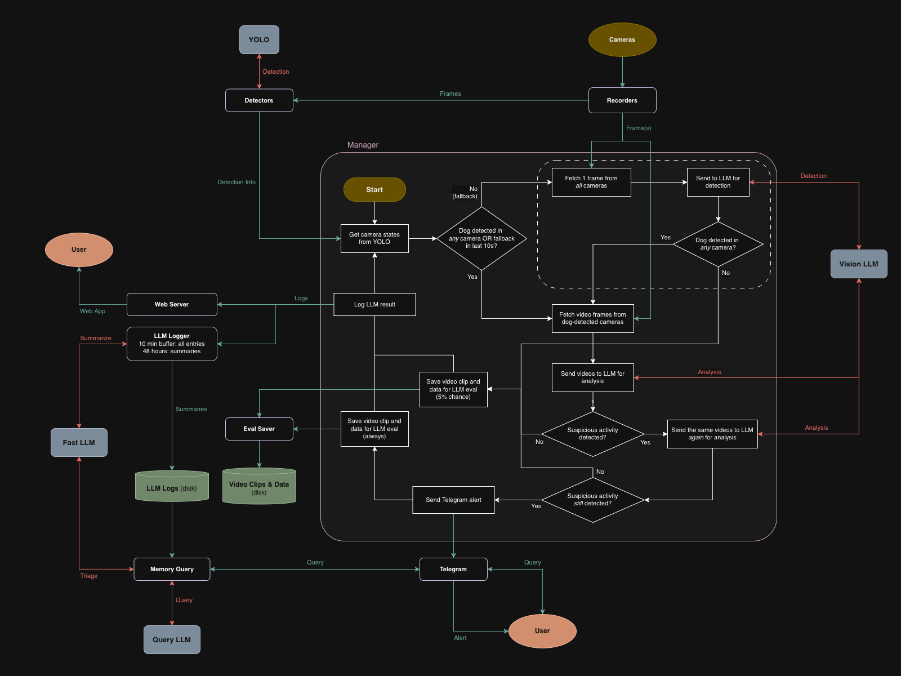

# Dog Behavior Detector

## Introduction

This is a personal project for detecting dog behavior using RTSP-supported home security cameras, YOLO object detection, and vision-language models (VLMs/LLMs). If a specified unwanted behavior (e.g. destructive behavior, zoomies, chewing) is detected, it sends an alert to your Telegram chat.

### Features

- Telegram integration
    - Real-time behavioral alerts and system alerts
    - Detailed configuration options for individual chats: alert threshold, snooze, mute, etc.
    - Ask AI anything about the past 48 hours
- Web live feed available (port 8972)
- Robustness improvements
    - False positive reduction with requiring 2 consecutive positives
    - Fallback object detection using VLM if YOLO fails to detect a dog
    - Easy integration with third-party monitoring services (e.g., Healthchecks.io)
- Highly customizable
    - Vast configuration options (`config.yaml`)
    - Fully customizable LLM prompts (`prompts/*.txt`)
    - Automatically saves video files and data for model evaluation or training
    - Easy to understand open-source code

## Usage

Initial setup will only take 5-10 minutes, but hours of testing and fine-tuning is recommended before using it in "production". See [USAGE.md](USAGE.md) for details.

### Requirements/Prerequisites

- The server should be running Ubuntu 22.04 or later on an x86-64 CPU.
- You must have access to a locally-hosted OpenAI-compatible API endpoint. 
    - [vLLM](https://vllm.ai/) is recommended for maximum performance, but other apps such as [Ollama](https://ollama.com/) or [LM Studio](https://lmstudio.ai/) can also be used.
- Your server must be running [go2rtc](https://github.com/AlexxIT/go2rtc) or similar to forward RTSP streams locally.
- All necessary drivers (including GPU drivers) must be setup.
- At least **some knowledge in Linux, Docker, and YAML** is strongly recommended.

### Limitations

You should never use this as a primary supervision method for your dog; it's best if you use it as a backup tool. Expect lots of false negatives and false positives until you fine-tune the prompt and config, and even then, some of them will be inevitable due to the inherent limitations of AI and cameras.

### Disclaimer

This project was tested on the following hardware for eight (8) 2K cameras:
- **CPU**: Intel Core i5-10210U, AMD Ryzen 3900X
- **GPU - YOLO**: Intel UHD Graphics, NVIDIA RTX 5070 Ti (shared with LLM)
- **GPU - LLM**: RTX 5090, RTX 5070 Ti using vLLM
- **RAM**: DDR4-2666 32GB, DDR4-3600 32GB

This *personal* project has not been tested with other devices and might not work for your hardware out-of-the-box. You may need to modify the source code for this to work on your device; do it at your own risk.

## Software Architecture

### Code Flow

Here is the high-level overview of the code flow:

Basically the following loop repeats forever:

1. Detect dog using YOLO (or the fallback LLM if YOLO doesn't detect any for a while)
1. Send video clip to LLM for analysis
1. If positive, send the same clip to LLM again for re-analysis, to reduce false positives
1. If still positive, send Telegram alert
1. Save video clips and data for LLM evaluation

> Note: This *high-level overview* does not include edge case handling such as cameras going offline or LLM errors.

### Files

- `data`: Data generated by the application
- `models`: YOLO model files
- `prompts`: LLM prompt files
- `src`: Python source files
    - `config.py`: Config object schema from config file
    - `detector.py`: Detector component - runs YOLO object detection periodically
    - `eval_saver.py`: Eval Saver component - saves video clips and data to `data/alerts` and `data/eval`
    - `llm_logger.py`: LLM Logger component - keep 48-hour record of LLM outputs
    - `llm.py`: Interface for interacting with LLM/VLM
    - `main.py`: Contains main function
    - `manager.py`: Manager component - orchestrates everything
    - `memory_query.py`: Functions for querying
    - `recorder.py`: Recorder component - keeps rolling buffer of recent video frames
    - `state.py`: YOLO detection status object schema
    - `telegram_commands.py`: Telegram command handlers
    - `telegram.py`: Interface to Telegram API
    - `utils.py`: Shared utility functions
    - `web_server.py`: Interface to web server hosting the live feed
- `web`: Web live feed (port 8972)

### License

GNU General Public License (GPL)